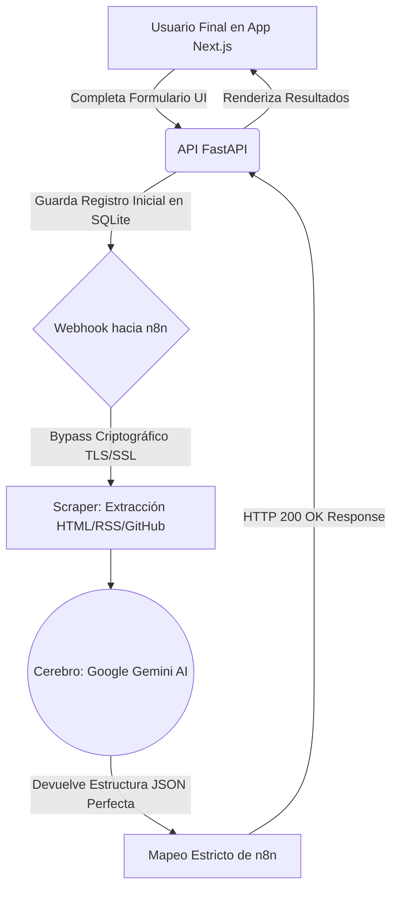
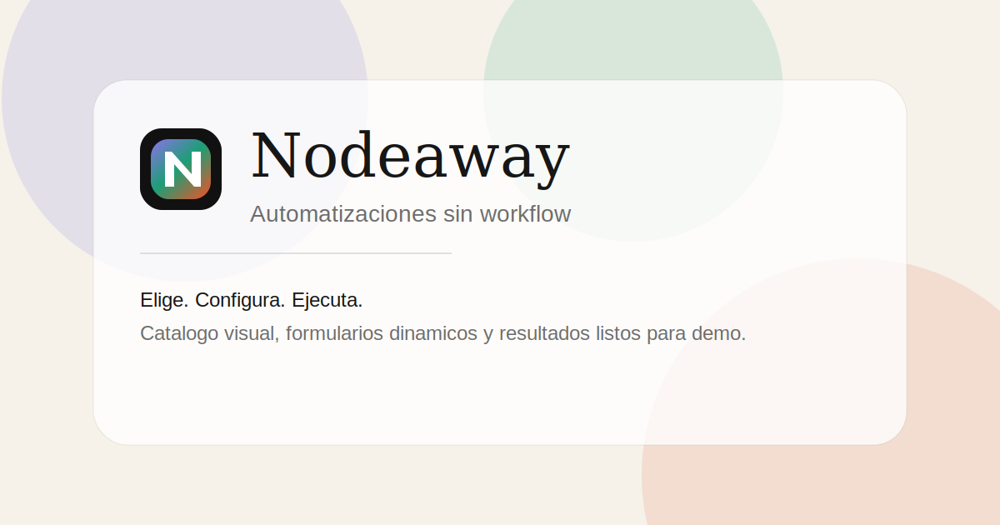

<div align="center">
  
  <h1>Nodeaway</h1>
  <p><strong>Elige. Configura. Ejecuta. Automatizaciones de alto nivel listas para usar, sin flujos visibles ni complicaciones.</strong></p>
</div>

<hr/>

## 🚀 La Visión del Proyecto (Hackathon)
El ecosistema actual de automatizaciones (n8n, Make, Zapier) es excelente para ingenieros de sistemas, pero es **intimidante** para el usuario de negocios promedio. Ver diagramas complejos de nodos ahuyenta la adopción.

**Nodeaway** invierte el paradigma: empaquetamos flujos de automatización altamente complejos en "Recetas" fáciles de digerir. El usuario final solo ve un catálogo Premium, llena un formulario simple (Ej. *"Analiza mi web"*) y Nodeaway hace la magia técnica en las sombras empleando IA Generativa y Webhooks estrictos.

## 🛠 Arquitectura Técnica (El Stack)

Este no es un MVP frágil; Nodeaway está construido sobre una arquitectura distribuida tolerante a fallos:

*   **Frontend Cautivador:** Aplicación construida en **Next.js 14 (React)**, estéticamente revolucionada con **Tailwind CSS** y animaciones hiper-suaves con **Framer Motion**. Diseño responsivo inspirado en librerías de componentes UI premium (21st.dev).
*   **API Gateway Ágil:** Microservicio core en **FastAPI (Python)** que maneja las solicitudes asíncronas, enruta payloads, interactúa con la base de datos veloz en **SQLite**, y mantiene viva la comunicación mediante *Webhooks*.
*   **Orquestador Fantasma:** **N8N** operando de motor en el backend profundo ("Headless"), encargado del enrutamiento de red, raspado de datos (Scraping) sin bloqueos SSL locales e integración inter-app.
*   **Cerebro Semántico:** Integración nativa a cero latencia con **Google Gemini (Flash)**. Toda la data cruda, sin importar su nivel de desorden en internet, es tabulada a formato JSON estructurado perfecto por modelos LLM de nueva generación.

### Diagrama de Flujo (System Design)



## ⚙️ Cómo Correr el Proyecto (Despliegue Rápido)

Con `docker-compose`, Nodeaway se despliega interconectando sus continentes en un solo comando, con su propia red y resolución de puertos internos y variables de entorno (`.env`):

### 1. Variables de Entorno
Clona de plantilla e inyecta tus credenciales, especialmente la de Gemini:
```bash
cp .env.example .env
```
Asegúrate de poner tu llave de Gemini:
`GEMINI_API_KEY=tu_api_key_aqui`

### 2. Levantar la Orquestación Completa
*(Docker se encargará del healthcheck al backend antes de encender Next.js)*
```bash
docker-compose up -d --build
```

## ☁️ Despliegue en CubePath (Cloud Infrastructure)

Para cumplir con la alta demanda que exige orquestar Inteligencia Artificial, webhooks y frontend en tiempo real, **toda la infraestructura de Nodeaway está alojada nativamente en VPS de CubePath** (`vps23596.cubepath.net`). 

**¿Cómo utilizamos CubePath en este proyecto?**
1. **N8N Dedicado:** Levantamos el orquestador n8n como un servicio robusto directamente en una instancia de CubePath para garantizar un *uptime* impecable y latencia cero al ejecutar los webhooks de automatización.
2. **Dockploy:** Utilizamos Dockploy sobre la infraestructura de CubePath para el CI/CD y gestión ágil de los contenedores (Next.js y FastAPI), permitiendo escalar o reiniciar servicios con un solo clic.
3. **Red Interna:** Al tener las bases de datos (SQLite), la API en Python y N8N en la misma VPC/Instancia de CubePath, la comunicación interna es rápida y segura, esquivando latencias externas en los requests.

## 🔗 Demo y Repositorio
* **🌐 Link a la Demo en vivo:** [https://nodeawayhack.duckdns.org](https://nodeawayhack.duckdns.org)
* **📁 Repositorio Público:** Este código está disponible en [https://github.com/AnluYaens/nodeaway](https://github.com/AnluYaens/nodeaway).

## 📸 Pantallas del Producto
*(Agrega aquí capturas o GIFs demostrando cómo se usa y los resultados de Gemini generados por n8n).*



## ✒️ Autores y Derechos
Este proyecto fue ideado, diseñado y desarrollado íntegramente para esta Hackathon por el equipo fundador:
* **Angel Jaen** ([@anluyaens](https://github.com/anluyaens))
* **Sebastián Armas**

*El código fuente de este repositorio se hace público con fines evaluativos para la Hackathon. No obstante, la marca comercial "Nodeaway", su propuesta de valor, diseño de producto y derechos de propiedad intelectual subyacentes están estrictamente reservados por sus autores (2026).*

---
> *"Los flujos de trabajo son para los ingenieros. Los resultados son para los clientes."* — **Nodeaway**
