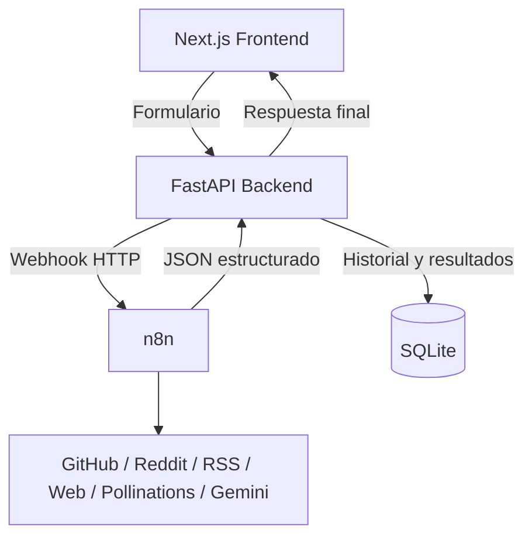

<div align="center">
  <h1>Nodeaway</h1>
  <p><strong>Automatizaciones listas para usar con una interfaz cuidada, un backend ligero y n8n como motor real de ejecución.</strong></p>
</div>

Nodeaway empaqueta automatizaciones complejas en una experiencia simple: el usuario elige una receta, completa un formulario y recibe un resultado útil sin tener que tocar nodos, prompts ni integraciones.

El objetivo del proyecto en hackathon es claro: esconder la complejidad operativa sin esconder la lógica. La fuente de verdad sigue siendo la automatización en n8n, pero la experiencia se presenta como un producto final, no como un builder.

## Qué resuelve

- Reduce la fricción de uso de herramientas tipo n8n, Make o Zapier para usuarios no técnicos.
- Convierte workflows en recetas con contrato de entrada y salida estable.
- Mantiene trazabilidad: FastAPI dispara webhooks reales de n8n, guarda historial y renderiza resultados en una UI enfocada en demo y uso real.

## Automatizaciones incluidas

Actualmente el catálogo incluye 6 workflows activos:

1. `landing-page-analyzer`
   Analiza una landing page y devuelve score, secciones, diagnóstico y recomendaciones.
2. `github-health-auditor`
   Evalúa la salud general de un repositorio público de GitHub, incluyendo contributors, issues y señales de mantenimiento.
3. `github-issue-summarizer`
   Resume y clasifica issues abiertos por prioridad.
4. `reddit-opinion-radar`
   Consulta Reddit y devuelve opinión agregada o un estado controlado si la fuente no está disponible.
5. `rss-news-digest`
   Genera un digest de noticias recientes a partir de RSS de Google News.
6. `social-post-generator`
   Genera copies para varias redes y una imagen de campaña a partir de la descripción de un producto.

## Arquitectura



### Capas del sistema

- `frontend/`
  Aplicación en Next.js 14 con TypeScript, Tailwind CSS y Framer Motion.
- `backend/`
  API en FastAPI que valida payloads, llama a n8n, normaliza respuestas y persiste historial en SQLite.
- `n8n`
  Motor de automatización real. Los workflows se exponen mediante webhooks y resuelven la lógica de negocio.

## Stack

- Frontend: Next.js 14, React 18, TypeScript, Tailwind CSS, Framer Motion
- Backend: FastAPI, httpx, aiosqlite, uvicorn
- Orquestación: n8n
- Persistencia: SQLite
- Integraciones: GitHub, Reddit, RSS, scraping web, Pollinations, Gemini

## Decisiones técnicas importantes

- La fuente de verdad es n8n.
  El frontend no inventa resultados ni usa rutas paralelas fuera de los workflows.
- Los contratos de salida están normalizados.
  FastAPI valida y adapta respuestas para que la UI reciba estructuras consistentes.
- Los workflows críticos no dependen ciegamente del LLM.
  Donde aporta valor, Gemini actúa como enriquecimiento opcional; donde no, la salida se calcula de forma determinista.
- La app guarda historial de ejecuciones.
  Esto permite reabrir resultados y mostrar una experiencia más cercana a producto.

## Estado actual del proyecto

Antes de la entrega se revisó el sistema completo y se corrigieron varios puntos de riesgo:

- validación más estricta para URLs de entrada y bloqueo de destinos internos obvios
- eliminación de exposición innecesaria de `n8nWebhookPath` hacia el frontend
- CORS endurecido con allowlist configurable
- contributors reales en `github-health-auditor`
- manejo controlado de `403` en Reddit sin alucinaciones
- salida no vacía y validada en `landing-page-analyzer`
- deduplicación de fuentes en `rss-news-digest`
- fallback robusto de imagen en `social-post-generator`

## Validación realizada

En la revisión final se comprobó:

- build del frontend correcto con `npm run build`
- compilación estructural del backend correcta
- pruebas reales de los 6 workflows activas el `31 de marzo de 2026`

Workflows probados:

- `landing-page-analyzer` con `https://www.infolavelada.com/`
- `github-health-auditor` con `facebook/react`
- `github-issue-summarizer` con `vercel/next.js`
- `reddit-opinion-radar` con `notion calendar`
- `rss-news-digest` con `IA, Startups`
- `social-post-generator` con `laptop msi delta 15`

## Demo

- Demo en vivo: [https://nodeawayhack.duckdns.org](https://nodeawayhack.duckdns.org)
- Repositorio: [https://github.com/AnluYaens/nodeaway](https://github.com/AnluYaens/nodeaway)

## Infraestructura en CubePath

Para la demo y la entrega de hackathon, Nodeaway se apoya en infraestructura desplegada sobre CubePath.

### Cómo se usa CubePath en este proyecto

- `n8n` corre como servicio dedicado dentro de la infraestructura de CubePath.
  Esto permite exponer los webhooks reales de automatización y mantener la lógica operativa fuera del frontend.
- El frontend y el backend se publican como servicios separados.
  La app de usuario consume la API de FastAPI, y FastAPI se comunica con n8n mediante webhook HTTP.
- La base operativa queda centralizada en el mismo entorno.
  Esto reduce fricción al probar integraciones, simplifica la demo y evita depender de servicios repartidos en distintos hosts durante la presentación.

### Qué aporta CubePath a Nodeaway

- despliegue rápido para iterar durante la hackathon
- hosting estable para exponer la demo pública
- una base clara para operar n8n, backend y frontend como piezas de un mismo producto

En esta arquitectura, CubePath no es solo hosting: es la capa que permite que la experiencia de Nodeaway se vea como un producto terminado y no como un conjunto de herramientas conectadas de forma manual.

## Cómo levantar el proyecto

### Requisitos

- Node.js 18+
- Python 3.11+
- una instancia de n8n accesible por webhook

### 1. Variables de entorno

```bash
cp .env.example .env
```

Variables relevantes:

- `N8N_API_URL`
  URL base de tu instancia de n8n. El backend llama a `webhook/...` sobre esta base.
- `N8N_API_KEY`
  Usada por el MCP y operaciones de mantenimiento sobre n8n.
- `NEXT_PUBLIC_API_URL`
  URL pública del backend.
- `NEXT_PUBLIC_SITE_URL`
  URL pública del frontend.
- `CORS_ALLOW_ORIGINS`
  Lista separada por comas de orígenes permitidos para el backend.

### 2. Levantar con Docker Compose

`docker-compose.yml` levanta frontend y backend. n8n debe estar disponible aparte en la URL configurada.

```bash
docker-compose up -d --build
```

Servicios expuestos:

- frontend: `http://localhost:3001`
- backend: `http://localhost:8000`

### 3. Levantar en local sin Docker

Backend:

```bash
cd backend
python -m venv .venv
.venv\Scripts\activate
pip install -r requirements.txt
uvicorn main:app --reload --host 0.0.0.0 --port 8000
```

Frontend:

```bash
cd frontend
npm install
npm run dev
```

## Estructura del repositorio

```text
frontend/                 App de usuario en Next.js
backend/                  API FastAPI, recetas, modelos y servicios
backend/recipes/          Definición de catálogo y formularios
backend/n8n-workflows/    Exports locales de workflows
backend/n8n-workflows-samples/
.env.example              Plantilla de configuración
docker-compose.yml        Orquestación local de frontend + backend
```

## Capturas


## Limitaciones conocidas

- Algunos proveedores externos pueden devolver bloqueos o rate limits; cuando eso ocurre, los workflows deben responder un estado controlado y no inventar contenido.
- `docker-compose.yml` no levanta n8n dentro del mismo stack, por lo que la instancia de n8n debe existir previamente.
- El proyecto está preparado para demo y hackathon; aún admite más hardening para un entorno de producción estricto.

## Autores y Derechos

Este proyecto fue ideado, diseñado y desarrollado para esta hackathon por el equipo fundador:

- Angel Jaen
- Sebastián Armas

El código fuente de este repositorio se hace público con fines evaluativos para la hackathon. Aun así, la marca `Nodeaway`, su propuesta de valor, diseño de producto y los derechos de propiedad intelectual subyacentes permanecen reservados por sus autores.

---

> Nodeaway no vende nodos. Vende resultados.
